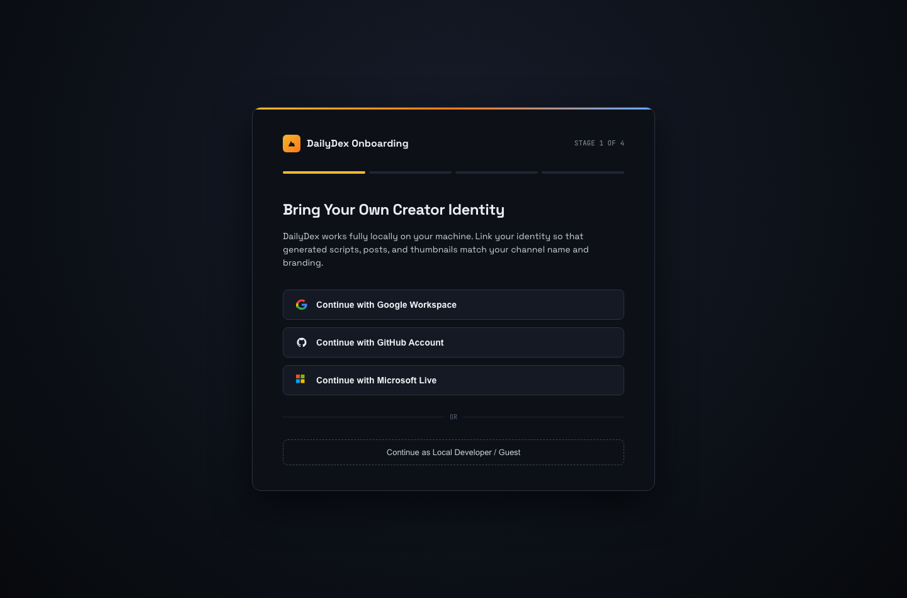
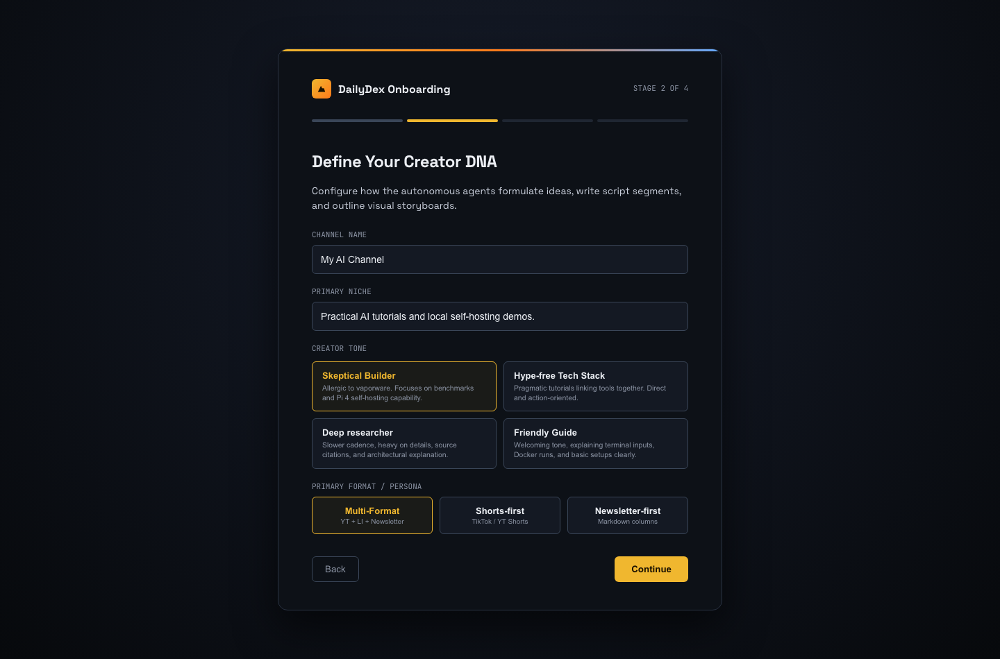
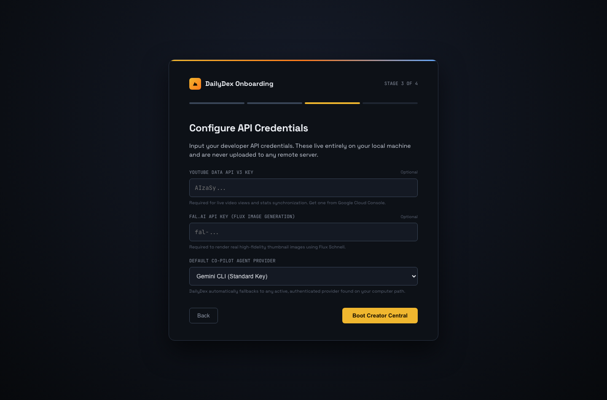
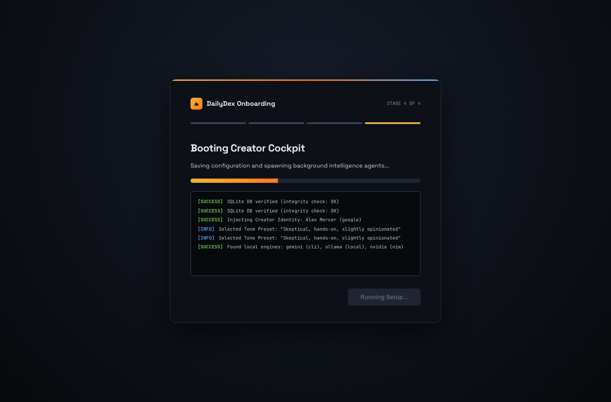
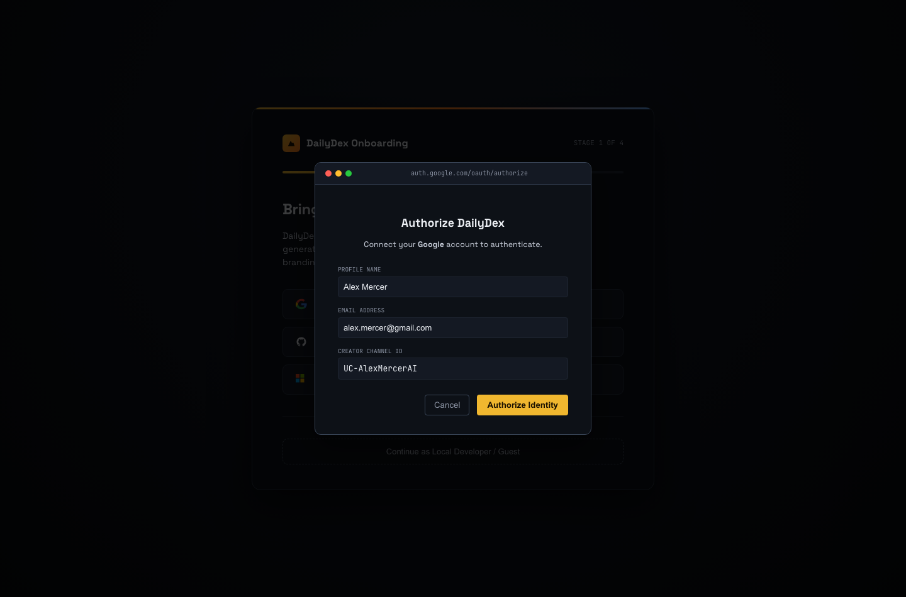
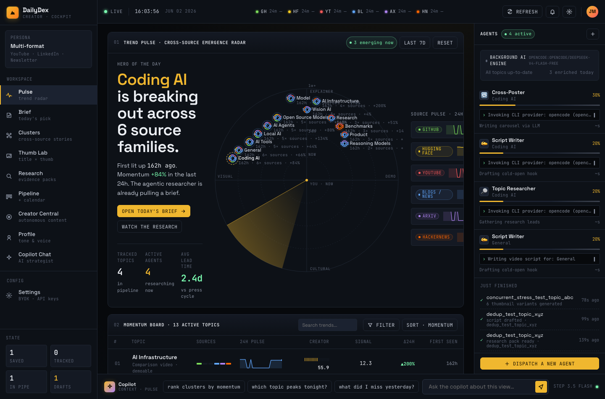
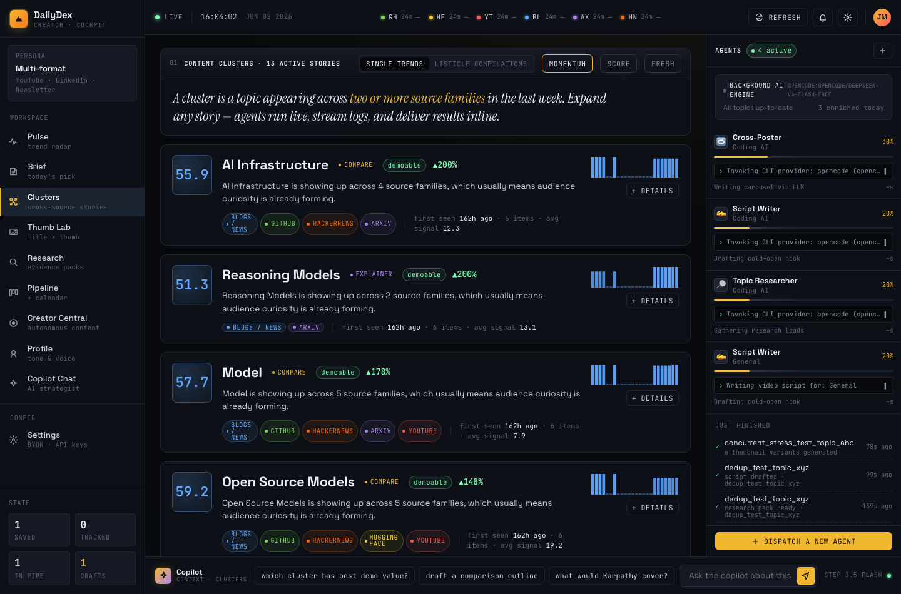
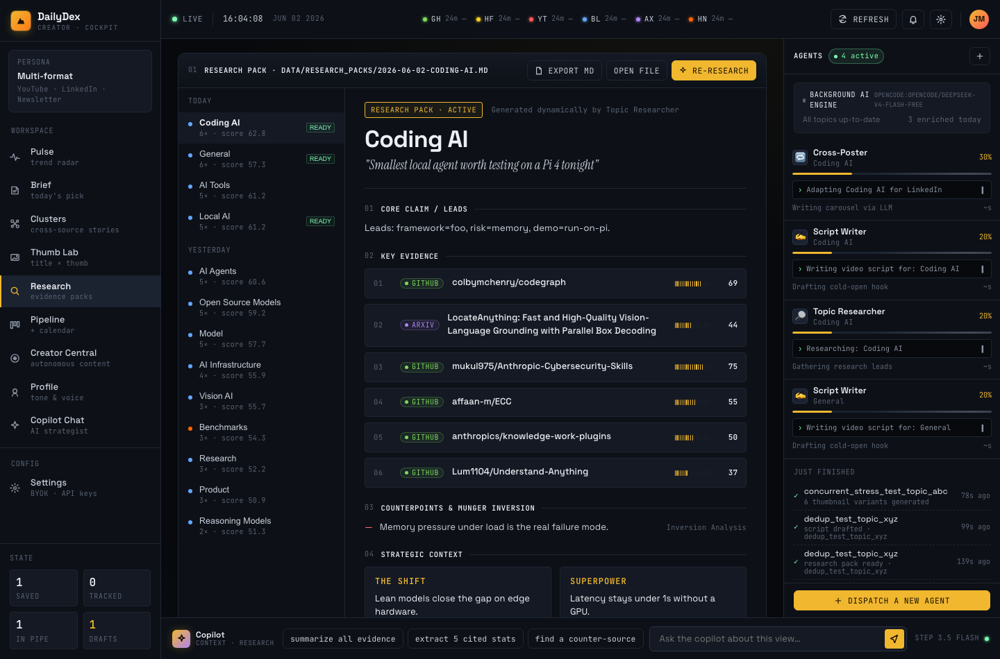
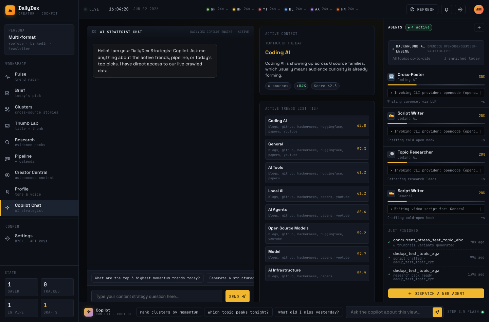
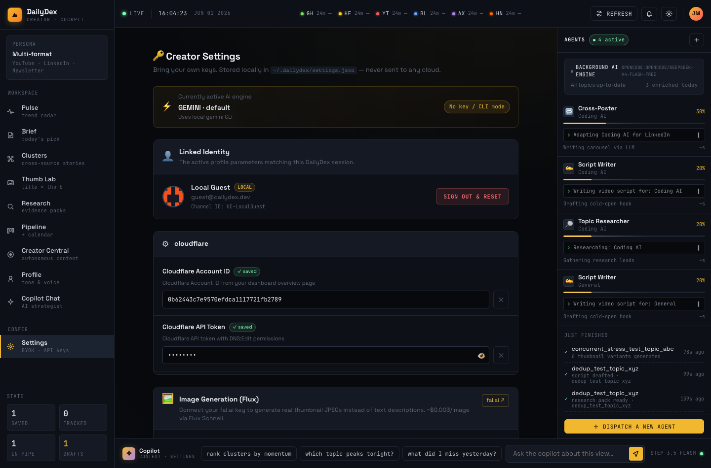

# DailyDex — Creator Cockpit


> **Live demo** → [dailydex.dpdns.org](https://dailydex.dpdns.org/)

DailyDex is an open-source AI content strategist and signal cockpit for creators, developer-relations teams, and AI educators. It turns raw developer signals — GitHub trending repos, HuggingFace model cards, Hacker News threads, arXiv papers, and YouTube tech channels — into structured video scripts, visual thumbnail concepts, and multi-platform text assets, all from a single local-first dashboard.

---

## 🚀 Key Capabilities

| Category | Feature |
|---|---|
| **Workspace** | React 18 Creator Cockpit with 10 views: Pulse, Brief, Clusters, Thumb Lab, Research, Pipeline, Creator Central, Profile, Copilot Chat, Settings |
| **Intelligence** | Recursive LLM deep-dives extracting technical shifts, contrarian hooks, narrative beats, and audience alignment |
| **Pipeline** | Drag-and-drop Kanban: `Idea` → `Researching` → `Script Ready` → `Recording` → `Published` |
| **Forge Studio** | Split-pane workstation coordinating three autonomous content agents (Researcher, Script Writer, Thumbnail Director) |
| **Notion Sync** | One-click outline and storyboard export to Notion databases (`✅ Synced ↗`) |
| **9:16 Shorts Slicer** | Auto-segments published videos into vertical shorts with timestamps, hooks, and virality scores |
| **Title A/B Testing** | Live title variant comparison tracking views, impressions, and CTR with real-time leading indicator |
| **Onboarding Wizard** | 4-step local-first setup: OAuth identity → Creator DNA → BYOK API keys → Engine boot |
| **Dual Deployment** | **Self-hosted CLI** (opencode, claude, hermes, kilocode, agy, ollama) or **Cloud VM API** (direct REST to Anthropic, OpenAI, NVIDIA NIM) |
| **Analytics Sync** | No-auth YouTube scraper that parses live view counts from public URLs — no OAuth required |
| **Command Verifier** | Extracts setup commands from scripts and validates them against GitHub, PyPI, npm, and Docker Hub |
| **Listicles Engine** | Groups trending signals into structured weekly roundup scripts |
| **Copilot Chat** | Context-aware LLM strategist loaded with live feed telemetry per view |
| **Thumbnails** | AI-generated visual concept mockups per topic cluster via fal.ai Flux |

---

## 📸 Interactive Showcase

### Onboarding Setup Wizard

Setting up DailyDex takes under 60 seconds with the step-by-step local-first wizard:

| Stage 1: Identity | Stage 2: Creator DNA | Stage 3: BYOK Keys | Stage 4: Engine Boot |
|---|---|---|---|
|  |  |  |  |

Stage 1 includes a simulated browser OAuth popup for Google, GitHub, and Microsoft Live:



---

### Pulse & Brief

The default landing views show real-time developer signal telemetry and today's highest-value content opportunity.

| Pulse (Trend Radar) | Brief (Today's Pick) |
|---|---|
|  |  |

---

### Clusters & Research

Cross-source story clustering and deep-dive evidence packs.

| Clusters | Research |
|---|---|
|  |  |

---

### Production Pipeline

Drag-and-drop Kanban with publishing calendar, niche-calibrated time-slot optimizer, A/B test configuration, and 9:16 shorts slicer.


---

### Creator Central (Forge Studio)

Split-pane autonomous content workstation — run recursive deep-dives, draft scripts, and review visual concepts.


---

### Copilot Chat & Settings

| Copilot (AI Strategist) | Settings (Dual Deployment Profiles) |
|---|---|
|  |  |

The Settings panel lets you toggle between **Self-hosted CLI Mode** (local binaries on your `$PATH`) and **Cloud VM API Mode** (REST endpoints for headless deploys).

---

### Thumb Lab — Generated Thumbnails

The visual concept generator produces optimized thumbnail mockups per topic cluster:

| AI Agents | Coding AI | Open Source Models |
|---|---|---|
|  |  |  |

| AI Tools | General Hype |
|---|---|
|  |  |

---

## 🛠️ Quick Start

### Docker

```bash
docker build -t dailydex .

docker run -d --name dailydex \
  -p 8888:8888 \
  -v $(pwd)/data:/app/data \
  -e DATA_DIR=/app/data \
  -e DB_PATH=/app/data/intelligence.db \
  -e CACHE_DIR=/app/data/cache \
  -e DIGEST_DIR=/app/data/digests \
  -e DATA_FILE=/app/data/data.json \
  -e SCORED_DATA_FILE=/app/data/data_scored.json \
  --restart unless-stopped \
  dailydex
```
Open `http://localhost:8888` → you'll land on the onboarding wizard.

### Local Python Setup

```bash
python3 -m venv .venv
source .venv/bin/activate
pip install -r requirements.txt
python3 dashboard_new.py            # Flask API + in-browser React on port 8888
```

The React frontend compiles in-browser via Babel Standalone — no separate `npm` build step needed. Just open `http://localhost:8888/cockpit`.

### macOS launchd Service (Always-On)

```bash
scripts/macos/install.sh
```

Registers three services:
- `com.dailydex.app` — Flask app on login
- `com.dailydex.refresh` — hourly feed fetch + scoring
- `com.dailydex.studio` — content generation every 6 hours

---

## ⚙️ Configuration (BYOK)

DailyDex operates under a **Bring Your Own Keys** model. All credentials live locally in `~/.dailydex/settings.json` and are never uploaded:

| Setting | Description |
|---|---|
| **Deployment Mode** | `cli` (Self-hosted) or `api` (Cloud VM / VPC) |
| **CLI Binary Paths** | Custom overrides for `gemini`, `claude`, `opencode`, `hermes`, `kilocode`, `agy` |
| **YouTube Data API** | Real-time channel analytics sync |
| **fal.ai API Key** | Flux image generation for real thumbnail variants |
| **LLM Provider** | Gemini CLI, Claude Code, Ollama, NVIDIA NIM, or direct Anthropic/OpenAI REST |
| **Brand Voice** | Niche, tone, banned phrases, and automation thresholds in `config/creator_profile.json` |

---

## 🧪 Development & Testing

```bash
source .venv/bin/activate
pytest
```

Current: **59 passed**, 29 skipped across 15 test files covering routes, analytics sync, command validation, deployment modes, enrichment pipeline, and Docker contracts.

---

## 📦 Classic Version (v0.1 – v0.9)

The original DailyDex was a server-rendered feed cockpit for triaging daily AI signals. It's still accessible at `http://localhost:8888/classic`.

<details>
<summary>Classic features and screenshots</summary>

- **Telegram Bot Layer** — invite friends to vote on daily digests via `telegram_bot.py`
- **Markdown Digest** — generate formatted daily digests via `/api/digest`
- **Score Filters** — 80+ Hot, 60–79, <60 classification
- **Keyboard Shortcuts** — drawer via `?`

| Overview | Feed | Saved Board | Trends | Mobile |
|---|---|---|---|---|
|  |  |  |  |  |

</details>

---

## 📄 License

MIT — see [LICENSE](LICENSE).
