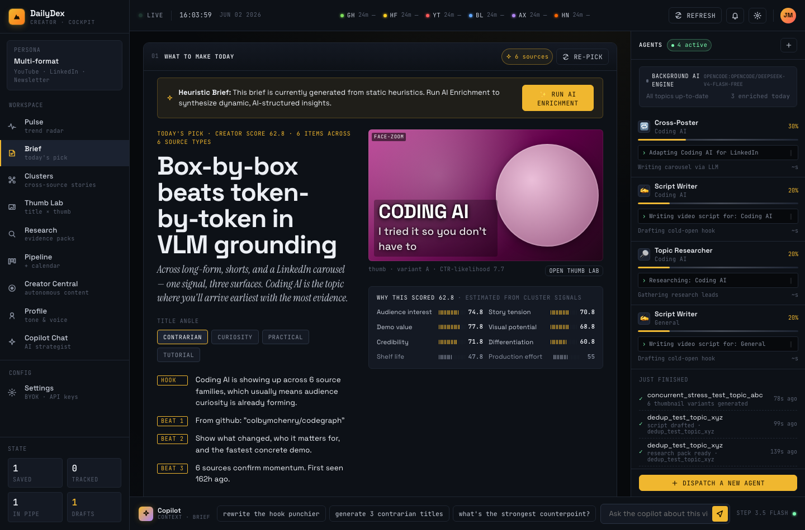
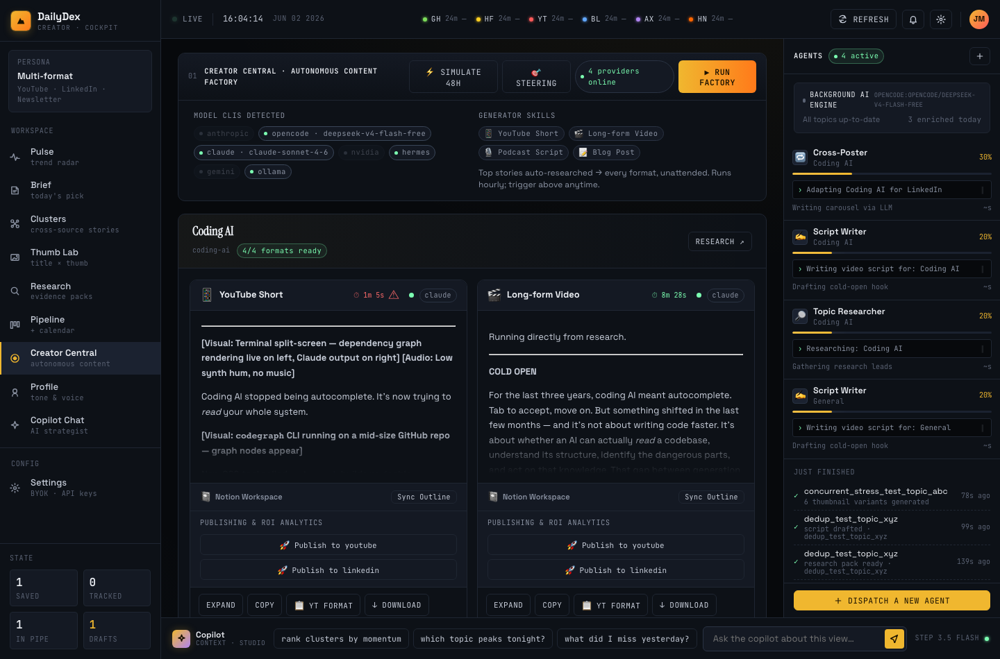
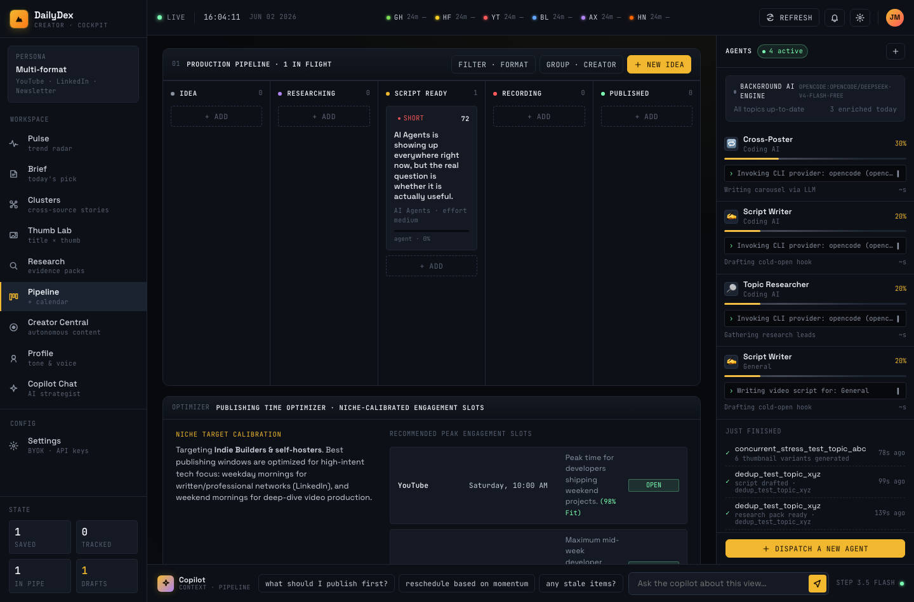

# DailyDex


DailyDex is a lightweight open-source AI signal cockpit for tracking high-value AI updates across GitHub, Hugging Face, research papers, videos, and news — with a Telegram bot for sharing daily picks with friends and letting them vote on what you should read.

It is built for people who want a daily AI signal cockpit instead of a generic RSS reader.

## Why It Exists

Most AI feeds are noisy.

DailyDex helps builders identify what matters, what is worth saving, what is worth testing, and whether source data is fresh.

It now also includes **DailyDex Creator Mode**, a creator-intelligence layer for turning AI signals into concrete content decisions, and a **Telegram social layer** so friends can vote on your daily picks.

## Highlights

- **Modern dashboard UI** with sidebar navigation and a clean overview page
- **Live update model** that refreshes the UI when server data changes
- **Source trust and freshness** visible at a glance
- **Top 5 daily signals** for fast triage
- **Try This Weekend** section for hands-on projects
- **Saved intelligence board** with workflow states
- **Creator Mode** for video ideas, content clusters, research packs, and script starters
- **Trends view** with charts and radar
- **Digest generation** in Markdown
- **Telegram bot** — friends subscribe, receive daily picks, and vote on items; voted items surface a badge on the dashboard
- **Flask + SQLite + JSON + vanilla JS** with no heavy frontend framework

## Screenshots

### Walkthrough


### Product Views

#### Overview


#### Feed


#### Saved Workflow Board


#### Trends


#### Mobile Overview


#### Creator Brief



#### Content Opportunities



#### Creator Pipeline



## Quick Start

### Docker

```bash
docker build -t dailydex .

docker run -d --name dailydex \
  -p 8888:8888 \
  -v $(pwd)/data:/app/data \
  -e DATA_DIR=/app/data \
  -e DB_PATH=/app/data/intelligence.db \
  -e CACHE_DIR=/app/data/cache \
  -e DIGEST_DIR=/app/data/digests \
  -e DATA_FILE=/app/data/data.json \
  -e SCORED_DATA_FILE=/app/data/data_scored.json \
  --restart unless-stopped \
  dailydex
```

Open `http://localhost:8888`.

### Local Python

```bash
python3 -m venv .venv
source .venv/bin/activate
pip install -r requirements.txt
python3 dashboard_new.py
```

### Telegram Bot (optional)

1. Create a bot via [@BotFather](https://t.me/BotFather) on Telegram and copy the token.
2. Set the environment variable:
   ```bash
   export TELEGRAM_BOT_TOKEN="your_token_here"
   ```
3. Run the bot in a separate terminal:
   ```bash
   python3 telegram_bot.py
   ```
4. Share your bot link with friends. They send `/start` to subscribe and `/digest` to get today's picks immediately.

Friends receive the top 5 scored items each day with signal bars and three inline buttons — **Read**, **Vote**, **Skip**. Votes are stored in the local SQLite database and appear as green `👍 N friends voted` badges on feed cards in your dashboard.

To broadcast the digest manually from the dashboard admin, call:
```
POST /api/bot/send
```

## Daily Workflows

### Daily check-in

1. Open **Overview**
2. Read the trust state and source health
3. Review **Today's Top 5**
4. Save anything worth revisiting

### Creator workflow

1. Switch to **DailyDex Creator**
2. Open **Creator Brief**
3. Pick the best video idea, a shorts idea, or a quick win
4. Generate a research pack
5. Move the idea through the content pipeline

### Saved intelligence workflow

1. Save items from Feed, GitHub, Models, or Research
2. Move them into `to_test`
3. Add notes and tags
4. Promote useful items or discard stale ones

### Digest workflow

1. Open **Daily Digest**
2. Generate the latest Markdown summary
3. Copy or save the digest for sharing

### Refresh workflow

1. Click **Refresh Now**
2. Wait for source health to update
3. Verify fresh data across all tabs

## Architecture

```text
DailyDex/
├── dashboard_new.py          # Flask app and routes
├── creator_intelligence.py   # creator scoring, briefs, clusters, and research packs
├── fetch_news.py             # external source fetch pipeline
├── scoring_engine.py         # scoring and ranking logic
├── data_models.py            # SQLite state, source health, subscribers, and votes
├── digest_generator.py       # Markdown digest generation
├── telegram_bot.py           # Telegram bot — daily digest and friend voting
├── templates/dashboard.html  # main server-rendered UI
├── static/app.css            # design system and layout
├── static/app.js             # live updates, interactions, and vote badge loader
├── config.json               # runtime source configuration, variants, and telegram settings
└── data/                     # runtime cache, digests, DB, and vote URL map
```

## System Flow

GitHub should render the Mermaid diagram below directly in the README. The editable source also lives in `docs/diagrams/dashboard-flow.mmd`.

```mermaid
%%{init: {'theme':'base','themeVariables':{'background':'#ffffff','primaryColor':'#dbeafe','primaryTextColor':'#0f172a','primaryBorderColor':'#3b82f6','lineColor':'#94a3b8','secondaryColor':'#eff6ff','tertiaryColor':'#fff7ed','fontFamily':'Inter, Arial, sans-serif'}}}%%
flowchart LR
    subgraph SRC[Collection Sources]
        direction TB
        GH[GitHub Trending]
        HF[Hugging Face]
        YT[YouTube Channels]
        BL[Blogs and News Feeds]
        AX[arXiv AI Papers]
    end

    subgraph PIPE[Intelligence Pipeline]
        direction TB
        FETCH[fetch_news.py]
        RAW[data/data.json]
        SCORE[scoring_engine.py]
        SCORED[data/data_scored.json]
        HEALTH[(source health)]
    end

    subgraph APP[DailyDex App]
        direction TB
        FLASK[dashboard_new.py]
        STATE[(saved items and tracked topics)]
        UI[dashboard.html + app.css + app.js]
    end

    subgraph LOOP[Live Update Loop]
        direction TB
        META[/api/dashboard-meta/]
        REFRESH[POST /api/refresh]
        LIVE[Hot-swap rendered UI]
    end

    subgraph BOT[Telegram Social Layer]
        direction TB
        TGBOT[telegram_bot.py]
        SUBS[(subscribers)]
        VOTES[(item votes)]
    end

    GH --> FETCH
    HF --> FETCH
    YT --> FETCH
    BL --> FETCH
    AX --> FETCH

    FETCH --> RAW
    FETCH --> HEALTH
    RAW --> SCORE
    SCORE --> SCORED

    BROWSER[Browser Session] --> FLASK
    FLASK --> SCORED
    FLASK --> STATE
    FLASK --> UI
    UI --> BROWSER

    BROWSER --> META
    META --> LIVE
    BROWSER --> REFRESH
    REFRESH --> FETCH

    SCORED --> TGBOT
    TGBOT --> SUBS
    TGBOT --> VOTES
    VOTES --> FLASK
    FLASK --> UI

    classDef source fill:#eff6ff,stroke:#3b82f6,color:#1e3a8a,stroke-width:1.5px;
    classDef pipeline fill:#f8fafc,stroke:#94a3b8,color:#0f172a,stroke-width:1.5px;
    classDef app fill:#eef2ff,stroke:#6366f1,color:#312e81,stroke-width:1.5px;
    classDef loop fill:#fff7ed,stroke:#f59e0b,color:#9a3412,stroke-width:1.5px;
    classDef bot fill:#ecfdf5,stroke:#10b981,color:#065f46,stroke-width:1.5px;
    classDef user fill:#ecfdf5,stroke:#10b981,color:#065f46,stroke-width:1.5px;

    class GH,HF,YT,BL,AX source;
    class FETCH,RAW,SCORE,SCORED,HEALTH pipeline;
    class FLASK,STATE,UI app;
    class META,REFRESH,LIVE loop;
    class TGBOT,SUBS,VOTES bot;
    class BROWSER user;
```



## API Surface

- `GET /` - dashboard UI
- `GET /health` - container health check
- `GET /api/data` - raw source data
- `GET /api/scored` - scored data payload
- `GET /api/dashboard-meta` - lightweight live-update snapshot
- `GET /api/source-health` - normalized source health summary
- `POST /api/refresh` - trigger external fetch and refresh
- `POST /api/save` - save an item
- `GET /api/saved` - list saved items
- `POST /api/research-pack` - generate a creator research pack
- `GET /api/research-packs` - list saved research packs
- `GET /api/creator-digest` - build the creator daily brief
- `PUT /api/saved/<id>/status` - update saved status
- `PUT /api/saved/<id>/notes` - update notes and tags
- `DELETE /api/saved/<id>` - remove saved item
- `POST /api/ignore` - hide an item
- `GET /api/ignored` - list ignored items
- `POST /api/track` - track a topic
- `GET /api/track` - list tracked topics
- `DELETE /api/track/<id>` - remove tracked topic
- `GET /api/digest` - build today's Markdown digest
- `GET /api/votes` - return friend vote counts per item URL
- `POST /api/bot/send` - broadcast daily digest to all Telegram subscribers

### Creator enrichment endpoints

- `POST /api/enrich` - enqueue one item for Gemini creator-pack generation
- `GET /api/enrich-status` - queue depth, worker state, provider label
- `GET /api/enrich/<content_hash>` - fetch the cached creator pack
- `POST /api/forge/<saved_id>` - generate multi-format Production Forge assets
- `GET /api/forge-status/<saved_id>` - poll forge progress + result
- `POST /api/agentic-run` - kick off the cluster-level agentic pipeline

## Creator Enrichment Pipeline

DailyDex turns scored AI items into real creator briefs by calling the **Gemini CLI** in
the background. The pipeline is cache-first so the dashboard stays responsive on a
Raspberry Pi 4:

1. Scoring runs as usual and produces deterministic baselines for every item.
2. Top items are enqueued to `creator_enricher.EnrichmentService`, which runs one
   Gemini subprocess at a time and writes the full creator pack
   (hook, beats, script, titles, thumbnails, b-roll, on-screen cues) to the
   `creator_assets` SQLite table keyed by a content hash.
3. The template merges cached LLM output on top of the baseline. Cards show an
   `LLM ✓` / `Queued` / `Draft` badge so it is obvious what is real synthesis vs.
   placeholder.
4. The agentic runner (`/api/agentic-run`) walks **topic clusters** through the
   same cache + a two-stage Gemini "recursive dive", saves the qualifying ones
   into the creator pipeline at `idea` or `script_ready`, and (above a score
   threshold) automatically fires the **Production Forge** to generate Shorts,
   Podcast, LinkedIn, Blog, and Demo assets.

### Brand voice configuration

Tune the writer by editing `config/creator_profile.json`:

- `tone`, `audience`, `niche`, `perspective` - identity injected into every prompt.
- `banned_phrases`, `preferred_words` - hard guardrails.
- `format_rules` - title length, hook length, thumbnail word count, short-script seconds.
- `signature_angles` - recurring framing hooks specific to the channel.
- `automation` - cluster thresholds: `auto_research_cluster_score`,
  `auto_script_ready_score`, `auto_forge_score`, `max_auto_promotions_per_day`,
  `enrichment_wait_seconds`.

### Pi 4 deployment notes

- The Docker image installs `@google/gemini-cli`. Build with
  `--build-arg DAILYDEX_SKIP_GEMINI=1` if you want to run an Ollama fallback
  (`LLM_PROVIDER=ollama`, `OLLAMA_MODEL=phi3:mini`).
- The enricher runs as a daemon thread inside the Flask process, so the image
  defaults to `GUNICORN_WORKERS=1`. If you scale workers, set
  `CREATOR_ENRICHER_PRIMARY=0` on every replica except one to avoid duplicate
  subprocess calls and a divergent queue.
- Configurable env vars: `GEMINI_BIN`, `GEMINI_MODEL`, `GEMINI_TIMEOUT`,
  `CREATOR_ENRICH_DAILY_LIMIT`, `CREATOR_PROFILE_PATH`, `LLM_PROVIDER`.

## Development

### Run tests

```bash
python3 -m pytest -q
```

### Validate key files

```bash
python3 -m py_compile dashboard_new.py data_models.py fetch_news.py telegram_bot.py
node --check static/app.js
```

## DailyDex Creator Mode

DailyDex Creator Mode is a separate variant focused on helping content creators answer one question fast: **what should I make today?**

Switch to **DailyDex Creator** from the variant picker to get:

- **Creator Brief** with the strongest video idea today
- **Content Opportunities** that turn AI items into actionable story cards
- **Shorts Ideas** with hooks, 30-second scripts, and visual suggestions
- **Content Clusters** showing stories appearing across multiple source families
- **Research Packs** saved as Markdown under `data/research_packs/`
- **Creator Digest** for daily planning
- **Creator Saved Pipeline** with statuses from `idea` to `published`

## Creator Potential Score

Every high-signal item can also receive a **Creator Potential Score** from 0 to 100.

The score is separate from Signal Score and weighs:

- novelty
- audience interest
- story tension
- practical demo value
- visual potential
- credibility
- shelf life
- production effort
- niche fit
- differentiation

## Content Opportunities

Creator opportunity cards include:

- topic and creator score
- recommended content format
- hook
- title options
- thumbnail text options
- source evidence
- production effort
- demo idea
- caveats
- script starter fields

## Content Clusters

Creator Mode groups related signals from GitHub, Hugging Face, arXiv, YouTube, and blogs/news into reusable story clusters.

Each cluster includes:

- topic
- source count
- related items
- average signal score
- creator score
- recommended angle
- best content format

## Research Packs

Research packs are saved as Markdown under:

```text
data/research_packs/YYYY-MM-DD-topic.md
```

Each pack includes:

- source links
- key facts
- counterpoints
- demo idea
- script outline
- title ideas
- thumbnail ideas

## Creator Digest

Creator Mode adds a dedicated digest format:

```text
# DailyDex Creator Brief - YYYY-MM-DD
```

It includes the best video idea, shorts ideas, long-form candidates, content clusters, quick wins, and the saved creator pipeline.

## Creator Saved Pipeline

Creator pipeline statuses:

- `idea`
- `researching`
- `script_ready`
- `recording`
- `published`
- `archived`

### Manual fetch

```bash
python3 fetch_news.py
```

## Release Validation

See [docs/release_validation_v0.9.md](docs/release_validation_v0.9.md) for manual validation checklist.

## Repository Docs

- `CONTRIBUTING.md`
- `SECURITY.md`
- `CHANGELOG.md`
- `docs/diagrams/dashboard-flow.mmd`
- `docs/release_validation_v0.9.md`
- `docs/screenshots/README.md`

## Roadmap

- better source configuration via UI
- smarter deduplication and clustering
- richer saved-item workflow operations
- deeper trend analytics with accessible chart fallbacks
- more source families and better source filtering
- LLM-assisted script generation
- YouTube API integration
- publishing calendar
- competitor channel tracking
- trend-to-video automation
- Reddit Pulse section (r/LocalLLaMA, r/MachineLearning)
- ProductHunt AI launches feed
- Model leaderboard delta tracking

## Project Status

v0.10 — Telegram Social Layer

This repo is actively evolving. Expect rapid iteration on data quality, workflow UX, and presentation.

## What's New (v0.10)

- **Telegram bot** — friends subscribe with `/start`, receive the daily top-5 digest with signal bars, and vote on items via inline buttons
- **Friend vote badges** — feed cards show a green `👍 N friends voted` badge when friends have voted for an item
- `GET /api/votes` — vote counts endpoint consumed by the dashboard
- `POST /api/bot/send` — trigger digest broadcast from the admin UI
- `telegram_bot.py` — standalone bot process with persistent URL hash map for vote tracking across restarts
- `python-telegram-bot>=20.7` added to requirements

## What's New (v0.9)

- Multi-variant support: switch between DailyDex (default), DailyDex Local, DailyDex Research, and DailyDex Tools
- Score filters: filter feed by 80+ Hot, 60-79, <60
- Tab search: search within each tab
- Keyboard shortcuts help: press `?` or click help button
- Correlation Signals: topics appearing across 2+ sources
- Topic Heatmap: frequency grid by source
- Sidebar and desktop layout cleanup with verified navigation rendering
- Mobile drawer behavior limited to phone-sized screens
- Saved-item export and bulk actions

## Contributing and Feedback

Issues and pull requests are welcome.

If you are using the dashboard for research, engineering leadership, or internal AI scouting, open a feature request and describe the workflow you want to support.

## License

MIT. See `LICENSE`.
