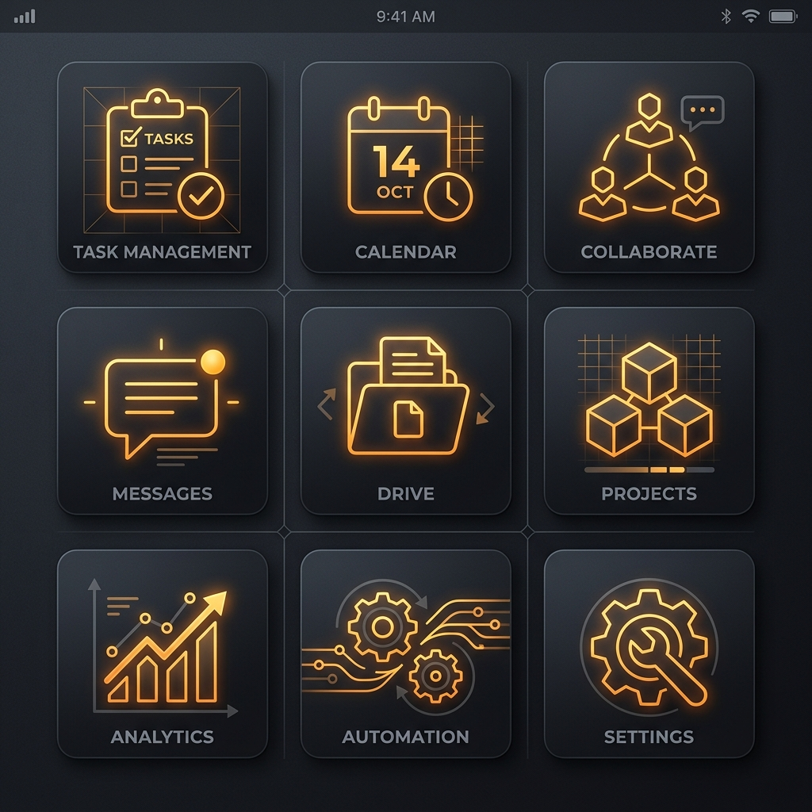

# DailyDex — Creator Cockpit


DailyDex is a lightweight, open-source AI content strategist and signal cockpit designed for turning high-value AI developments into video scripts, visual thumbnail concepts, and multi-platform text assets. It is built specifically for creators, developer relations, and AI educators who want to bypass noisy RSS feeds and build a structured content pipeline directly from raw code, papers, and tech videos.

---

## 🚀 Key Capabilities

- **React-based Creator Cockpit**: A premium, high-fidelity React frontend showing content opportunities, topic clusters, and a central workspace.
- **Recursive LLM Dives**: Multi-stage strategic research that extracts technical shifts, contrarian hooks, narrative beats, and target audience alignment.
- **Strategic Pipeline**: A Kanban board showing state progression from `Idea` → `Researching` → `Script Ready` → `Recording` → `Published`.
- **Forge Studio**: A two-panel workspace where creators edit forged assets and coordinate three AI Practicum content agents:
  - 📺 **YouTube Director**: Generates titles, timestamps, video descriptions, and talking points.
  - 🎬 **Shorts & Script Writer**: Outlines cold opens and vertical-ready scripts.
  - 💻 **Demo Architect**: Produces step-by-step terminal guides, annotation points, and storyboards.
- **Visual Thumbnail Concepts**: Auto-generates CTR-optimized textual layouts and premium visual variants matching your channel's niche.

---

## 📸 Interactive Showcase

### Walkthrough


### React Creator Cockpit

#### Creator Brief & Content Opportunities
The primary dashboard highlights the best content opportunities, recommended formats, and raw evidence.


#### Strategic Content Pipeline
Track and move ideas. Items marked `script_ready` feature a one-click **Forge in Studio** action.


#### Forge Studio & Content Agents
Run recursive deep-dives, draft scripts, and review visual concepts inside a split-pane workstation.


### Premium Generated Thumbnails
The visual concept generator produces optimized thumbnail mockups corresponding to target topic clusters:

| AI Agents | Coding AI | Open Source Models |
|---|---|---|
|  |  |  |

| AI Tools | General Hype |
|---|---|
|  |  |

---

## 🛠️ Quick Start

### Docker Setup
To run the server in a container with a persistent SQLite database and cash directories:
```bash
docker build -t dailydex .

docker run -d --name dailydex \
  -p 8888:8888 \
  -v $(pwd)/data:/app/data \
  -e DATA_DIR=/app/data \
  -e DB_PATH=/app/data/intelligence.db \
  -e CACHE_DIR=/app/data/cache \
  -e DIGEST_DIR=/app/data/digests \
  -e DATA_FILE=/app/data/data.json \
  -e SCORED_DATA_FILE=/app/data/data_scored.json \
  --restart unless-stopped \
  dailydex
```
Open `http://localhost:8888` in your browser.

### Local Python & React Setup
1. **Start the Flask Backend**:
   ```bash
   python3 -m venv .venv-cockpit
   source .venv-cockpit/bin/activate
   pip install -r requirements.txt
   python3 dashboard_new.py            # Serves API on port 8888
   ```
2. **Start the React Dev Server**:
   ```bash
   cd static/cockpit
   npm install
   npm run dev                         # Launches hot-reloaded frontend on port 5173
   ```

### macOS launchd Service (Always-On)
To keep the content fetching, scoring, and studio generation running in the background:
```bash
scripts/macos/install.sh
```
This registers:
- `com.dailydex.app`: Runs the Flask app on login.
- `com.dailydex.refresh`: Fetches and scores external feeds hourly.
- `com.dailydex.studio`: Runs content generation tasks every 6 hours.

---

## ⚙️ Creator Configuration & Custom Profiles
Inject your brand voice and channel format constraints by editing `config/creator_profile.json`:
- **Identity & Perspective**: Hard constraints on niche, audience level, and signature angles.
- **Banned Words**: Filter out cliché phrases like "game-changing", "revolutionary", and "delve".
- **Automation Thresholds**: Configure `auto_research_cluster_score` and `auto_forge_score` to let background agents automatically queue, outline, and script high-value topics.

---

## 🧪 Development & Verification
Run the unit test suite to verify code contracts and agent dispatching:
```bash
./.venv-cockpit/bin/pytest
```

---

## 📦 v0.1 Legacy / Classic Version

The classic version of DailyDex was a server-rendered feed cockpit for triaging daily AI signals, sharing picks with friends, and voting via Telegram.

### Classic Screenshots

#### Overview & Health Cards


#### Scored Feed View


#### Saved workflow Board


#### Trends & Radar Coordinates


#### Mobile View


### Classic Features (v0.1 - v0.10)
- **Telegram Bot Layer**: Invite friends to vote on daily digests via a Telegram bot (`telegram_bot.py`). Shows real-time vote count badges on feed cards.
- **Classic UI Router**: Access the classic dashboard directly via `http://localhost:8888/classic`.
- **Markdown Digest**: Generate formatted daily digests via `/api/digest` for newsletters or copy-pasting.

### Version History Archive
- **v0.10**: Added the Telegram bot voting integration and dynamic dashboard friend vote count badges.
- **v0.9**: Multi-variant supports, keyboard shortcut drawer (`?`), score classification filters (80+ Hot, 60-79, <60), and Topic heatmap frequency grids.
